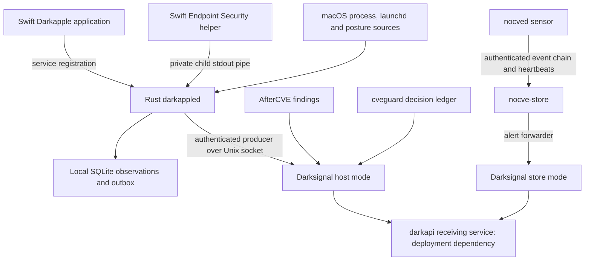

# Darkapple security model

Darkapple is the macOS (formerly OS X) observation component of the After Dark
host-security ecosystem. This document describes the implemented 0.1.0
architecture and its limits. It is not a certification of the host or a claim
that the development bundle is production-qualified.

## Reporting a vulnerability

Please do not put exploit details, credentials or host evidence in a public
issue. If GitHub private vulnerability reporting is enabled for
[afterdarksys/darkapple](https://github.com/afterdarksys/darkapple), use its
**Security → Report a vulnerability** workflow. If that option is unavailable,
open an issue requesting a private contact method without including sensitive
technical details. A dedicated reporting address and response-time policy have
not yet been established in this repository.

A private report should identify the affected commit/version, macOS version
and architecture, required privileges, reproduction steps, impact and a minimal
sanitized example. Remove API keys, provisioning profiles and personal data.

Version 0.1.0 is a development implementation. There is no published supported
release or security-update schedule yet. Consult the
[verification record](docs/verification.md) and [future plan](TODO.md) before
selecting it for deployment.

## Components and privileges

| Component | Responsibility | Security boundary |
| --- | --- | --- |
| Swift `Darkapple.app` | Presents service status and registers background services through SMAppService. | Registration and OS approval are separate from successful collection. The UI does not grant itself Full Disk Access or Endpoint Security privileges. |
| Rust `darkappled` | Collects snapshots, evaluates local rules, records observations and delivers signals. The standalone CLI is named `darkapple`. | Bundled launchd configuration runs it as root. Polling can run unprivileged with corresponding coverage limitations. |
| Swift `EndpointSensor.app` | Subscribes to Endpoint Security process notifications and sends bounded metadata to its parent. | Requires the appropriate Apple entitlement/profile, root and Full Disk Access. It is an app-wrapped child executable, not an installed system extension. |
| Darksignal | Authenticates producer processes, classifies signals, queues them and ships upstream. | Runs as a separate service with its own state and API credential. Darkapple is one configured producer. |

The GUI and daemon deliberately have distinct executable names because common
macOS filesystems are case-insensitive. The production bundle and configuration
must be installed with ownership and permissions appropriate for root execution.
The sample bundled services run as root; a least-privilege split is future work.

Endpoint Security subscriptions are `NOTIFY_EXEC`, `NOTIFY_FORK` and
`NOTIFY_EXIT`. Darkapple does not subscribe to authorization events, terminate
processes, isolate the host, change security settings or execute remotely
supplied commands. Missing native permissions result in unavailable coverage;
polling remains a separate collection path.

## Integration with the broader system

- **Darkapple** owns continuous macOS observations, detections, local evidence
  and collection coverage.
- **Darksignal** recognizes `darkapple` as a first-class host-mode producer. It
  maps the fixed rule set to threat/breach/vulnerability signals, preserves the
  source event ID, deduplicates retries and posts to
  `/v1/darksignal/darkapple`. The configured executable/uid and host must match.
- **AfterCVE** owns deeper incident collection and investigation. Darkapple's
  SQLite journal can be treated as a local artifact, but there is not yet a
  dedicated automatic AfterCVE acquisition adapter.
- **cveguard** owns policy evaluation and its decision ledger. This Darkapple
  integration does not supply a macOS enforcement adapter or automatically
  execute cveguard decisions. Its existing imported-intel path remains shadow.
- **nocved / nocve-store** supply the existing sensor/event-history pipeline.
  Darkapple does not yet send authenticated event chains directly to
  nocve-store. A Darksignal signal is not a substitute for those raw records.

The receiving darkapi service is a separate deployment dependency. Local tests
use a loopback receiver; production API acceptance and fleet delivery are not
established by those tests.

## Trust boundaries and authentication

### macOS to collectors

The running host is part of the trusted computing base. A compromised kernel,
root account or authorized collector can lie about observations or suppress
records. Signing and host-local access checks do not establish that the host
is uncompromised.

Process snapshots use PID plus process start time and check identity around
executable lookup. Polling can miss short-lived processes and cannot prove a
complete execution history. Launchd collection reads bounded files, keeps
content hashes rather than file contents, and reports inaccessible or malformed
input as partial coverage. A baseline is an observation, not an allowlist or
proof that its original contents were safe.

### Swift helper to Rust

Rust starts the configured helper after executable/ancestor ownership and
permission checks. It reads JSONL from that child's stdout pipe; there is no
public native-event ingress socket. The helper copies bounded event metadata
inside the ES callback before queueing it, so borrowed ES pointers do not cross
that boundary.

The native protocol caps each message at 65,536 bytes. Swift limits pending
writes to 512; Rust limits its message queue to 1,024. Kernel sequence gaps,
malformed messages and queue loss are accounted for. A failed or stalled helper
is reported unavailable. Automatic helper restart after permission changes is
not implemented.

These are filesystem and parent-child trust checks, not independent runtime
verification of the helper's signing identity. Path checks also do not amount
to pinning an executable against every possible replacement race.

### Rust to Darksignal

A frame contains a four-byte little-endian length followed by at most 65,536
bytes of JSON. It claims `tool: "darkapple"` and a host matching Darksignal's
configuration. Darksignal validates the peer's uid, executable path and file
identity; a tool name alone is insufficient. On macOS the implementation uses
peer credentials/PID and `proc_pidpath`, then stats the returned path. It has
process-exit/PID-reuse and executable-replacement limitations; it does not pin
a running image with a Linux-style pidfd.

Darkapple checks the socket and parent-directory type, ownership and permissions.
It does not independently validate the server executable's code signature or
perform a cryptographic mutual-authentication handshake. Root, or an attacker
controlling the trusted service identity, remains inside this trust boundary.

### Darksignal to the receiving service

Darksignal owns the upstream HTTPS client and API key; Darkapple does not need
that credential to submit locally. Darksignal's transport uses TLS 1.3 and a
protected key file. Backend credential scope, tenant/host authorization,
retention and alerting must be implemented and qualified in the receiving
service. The loopback HTTP option is for explicit local tests, not production.

## Data collected and retained

Darkapple currently records process identifiers/start times and executable
paths, launchd paths and hashes, selected posture values, coverage and detection
metadata. It does not collect argv, environment values, file contents into the
journal, or network payloads. Paths and process metadata can still contain
personal or sensitive operational information.

The SQLite database stores observations, baselines and delivery state. State
uses an owner-only 0700 directory and 0600 regular files, with symlink/hardlink
checks for state files and a single-writer lock. Configuration rejects unknown
fields, relative paths and `..` components; ownership and permissions are
validated. Trusted ancestor checks allow sticky directories such as
`/private/tmp`, but production state should use the protected deployment path.

The journal is **not encrypted by Darkapple and is not a cryptographically
chained off-host evidence store**. Root can read, modify or delete it. Completed
rows can be evicted or expire; pending rows remain until acknowledged and can
fill capacity. Export evidence needed for an investigation before retention
removes it. Protect exported artifacts separately.

## Delivery and health semantics

- A generated event's ID is committed with its observation and outbox record.
  Retries retain that ID; Darksignal uses it for deduplication/source references.
- ACK `1` means local handling. For an event this may be queue insertion or
  deduplication; for health it updates producer status without a threat signal.
  It does not prove remote storage, operator notification or evidence archival.
- ACK `0`, unexpected replies and transport failures leave events available for
  retry. Refusal currently cannot distinguish temporary capacity/storage failure
  from permanent invalid input.
- Collection and shipment run separately. Full storage still limits collection;
  loss counters and queue depth must be monitored.
- `status.json` is a snapshot: check its update time. An old healthy snapshot
  does not prove the agent is currently running.
- Darksignal reports Darkapple as available/degraded after authenticated health,
  silent after 90 seconds without health (or a backward receiver clock), and
  unseen before the first health frame. Unseen does not alone establish that
  Darkapple was expected on that host. Backend silence alerts are future work.

Detailed wire formats and rule mappings are in [the protocol](docs/protocol.md).
Detections are investigative indicators, not automatic proof of compromise;
legitimate development tools and application updates can trigger heuristics.

## Build, signing and current limitations

The development bundle uses ad-hoc signing. That verifies local packaging but
does not confer Developer ID trust, Apple entitlement approval, notarization or
Full Disk Access. The signing script accepts an operator-provided identity and
approved ES profile; it does not notarize, install or enroll machines. Do not
commit credentials, profiles, collected evidence or production configuration.

Apple Silicon runtime, live entitled ES collection, production signing/MDM and
production darkapi delivery are not yet qualified. Network Extension, Unified
Logging ingestion, Secure Enclave identity and active response are absent.
Review [TODO.md](TODO.md) for planned work rather than assuming those features
exist because the architecture can accommodate them.

The local verification record covers parser/storage behavior, wrong-producer
refusal, delivery retry/deduplication and live degraded collection. It is not a
penetration test, independent security audit or fleet-capacity qualification.
