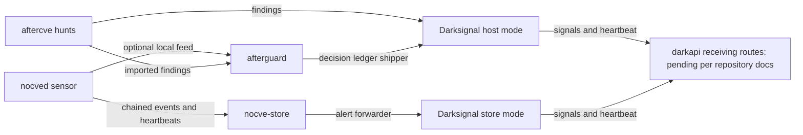

# Ecosystem review

Reviewed 2026-10-01 against the local sibling working trees, including source,
not only README claims. This is an architecture and integration review, not
a security audit or live deployment qualification. No services were started,
no production endpoints were contacted, and no sibling files were changed.
The parent directory asks for code-review-graph first; its tools were not
available in this session, so this review used source inspection.

## Responsibilities

| Component | Implemented responsibility | Boundary relevant to Darkapple |
| --- | --- | --- |
| nocved / nocve-store | Continuous host observations; bounded polling; process, network, authentication, auditd exec, Docker, package and persistence sources; chained and HMAC-authenticated spool; independent shipment and heartbeats. Store verifies chains, detects gaps/replays/stalls/silence, retains events in SQLite, raises host/fleet alerts and forwards alerts to Darksignal. | The sensor sources are Linux-oriented. Compiling on macOS does not supply equivalent coverage. Store event ingestion is a distinct protocol from Darksignal IPC. |
| aftercve | On-demand incident collection, hunts, timelines and investigation; local/SSH/fleet workflows; integrity-checked encrypted case bundles; artifact browser; macOS collectors for processes, sockets, accounts, launchd, packages and persistence. Quick-hunt findings can ship to Darksignal. | Owns forensic investigations. Active process termination is gated on Linux; the macOS implementation explicitly refuses it and requires manual action. |
| cveguard | `afterguard` evaluates first-match policy and records hash-chained decisions; `afteralert` exposes metrics; `afterseal` pins and checks toolchain identities. Feed import, rotation/gap tracking and ledger shipment are implemented. | Current imported intel stays shadow. No live eBPF producer and no executable isolation action; nftables output is a Linux plan. This is not a ready-made macOS enforcement service. |
| darksignal | Authenticates local producers, classifies individual submissions as threat/breach/vuln, assigns priority, deduplicates, queues in SQLite and ships over HTTPS. Host and store modes have different producer permissions. | It is a signal pipeline, not a raw-event archive or a general multi-event attack-graph engine. Joins associate entities; they do not prove causation. |

Sources: [nocved daemon](../../nocved/crates/nocved/src/daemon.rs),
[source interface](../../nocved/crates/nocved/src/sources/mod.rs),
[store ingest](../../nocved/crates/nocve-store/src/ingest.rs),
[aftercve macOS collectors](../../aftercve/src/collect/macos/mod.rs),
[containment](../../aftercve/src/contain/process.rs),
[guard engine](../../cveguard/crates/afterguard/src/engine.rs),
[guard shipper](../../cveguard/crates/afterguard/src/ship.rs),
[classification](../../darksignal/src/classify.rs).

## Existing data flow

Darksignal also accepts a nocved producer schema directly, but the documented
nocved delivery route is through its store. A supported schema is not evidence
of an implemented producer shipper.

## Exact integration contract

Source: [frame.rs](../../darksignal/src/frame.rs),
[config.rs](../../darksignal/src/config.rs),
[peer.rs](../../darksignal/src/peer.rs),
[ingest.rs](../../darksignal/src/ingest.rs),
[store.rs](../../darksignal/src/store.rs).

- One AF_UNIX stream connection per record; four-byte little-endian payload
  length followed by JSON, with a 65,536-byte maximum JSON payload.
- Envelope: `v: 1`, `tool`, `host`, `sent_at_ms`, object `body`.
- Accepted tools are exactly `nocved`, `aftercve`, `cveguard`, `afterseal`,
  and `nocve-store`. `darkapple` is currently rejected, including in config.
- Envelope host must equal the configured host. It uses dot-separated labels
  of 1–63 ASCII alphanumeric/underscore/hyphen bytes, up to 253 bytes overall.
- Producer config binds a tool to one uid and canonical executable path.
  macOS authentication already uses getpeereid, LOCAL_PEERPID and proc_pidpath.
  The macOS file identity comes from stat of the returned path, not a pinned
  running executable handle; the code documents its PID-reuse limitation.
- Only configured host-mode producers can submit on a host socket; a remote
  Mac cannot connect directly to a Linux host's Unix socket.
- ACK `0x01` means accepted **or intentionally dropped** (for example an
  unrecognized rule or informational event), including successful deduplication.
  It does not prove a signal was stored or delivered to darkapi.
- ACK `0x00` covers invalid input, authorization mismatch, full queue, and
  storage failure. It does not distinguish permanent from retryable failure.
- Classification emits at most one signal per submission, using fixed tables
  and producer-specific fallbacks. Adding an enum variant alone is insufficient.
- Pending queue cap is 10,000; lower-ranked non-breach rows may be evicted.
  Breach rows are protected from eviction. Dedupe has a retention window.
- Published signals use `darksignal.signal.v2`. Tool-specific HTTP paths are
  static enum mappings, so a new tool also needs a new route mapping.

## Findings that affect development

1. **A first-class Darkapple producer needs coordinated Darksignal changes.**
   Extend the tool enum, classification, entity joins/source references and
   tests, plus the API contract. Do not identify Darkapple as nocved or aftercve
   merely to get an ACK: that loses producer provenance and does not add macOS
   rule recognition.
2. **Local ingestion and fleet delivery are separate completion criteria.**
   Darksignal README and reporting design say the receiving darkapi routes are
   not implemented. This review did not independently inspect darkapi or probe
   a deployed endpoint. Fleet readiness therefore remains unverified.
3. **Transport ACK is not archival confirmation.** Keep raw observations and
   source coverage separately. Test the queued signal and HTTP payload, not
   just ACK `1`. Never describe local acceptance as remote delivery.
4. **Refusal needs a deliberate retention policy.** Existing guard and store
   forwarders advance on ACK `0`, although Darksignal can use it for temporary
   capacity/storage failure. Darkapple should retain refused records with
   bounded retry and visible counters; a protocol revision can eventually
   separate retryable refusal from permanent rejection.
5. **Reuse macOS knowledge already in aftercve.** Its parsers, bounded command
   execution and coverage reporting are relevant precedents. Its batch
   collection workflow is not itself a continuous sensor scheduler.
6. **Sensor silence needs an external observer.** A dead Darkapple cannot emit
   its own failure. Darksignal's own heartbeat is not proof that Darkapple is
   alive; per-producer liveness must be added to the integration design.
7. **Documentation has snapshot drift.** Darksignal README calls the cveguard
   shipper in progress, while cveguard's source implements it. The reporting
   design describes older defects already addressed by current classification
   and shipper source. Treat live source as the integration authority.

## Recommended Darkapple role

Darkapple should own continuous macOS observations, local detection, source
coverage and retained delivery state. Darksignal should continue to own signal
normalization and fleet shipment. Aftercve should continue to own detailed
case collection and investigation. A later macOS response adapter needs its
own design; Linux policy plans cannot simply be executed on macOS.

The first development milestone should demonstrate one real macOS observation
becoming a correctly attributed `darkapple` signal in Darksignal, with restart
and rejection behavior verified. See [the development outline](darkapple-design.md).
